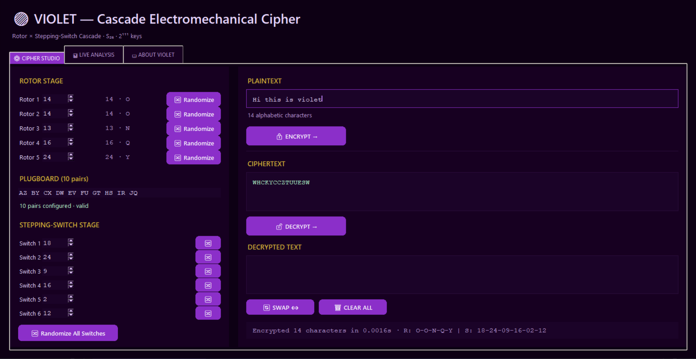
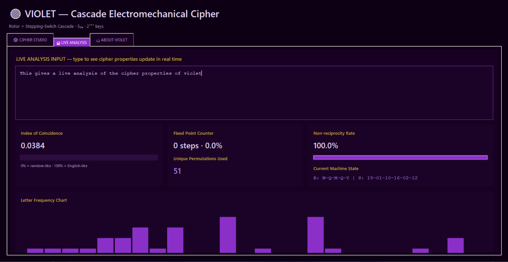
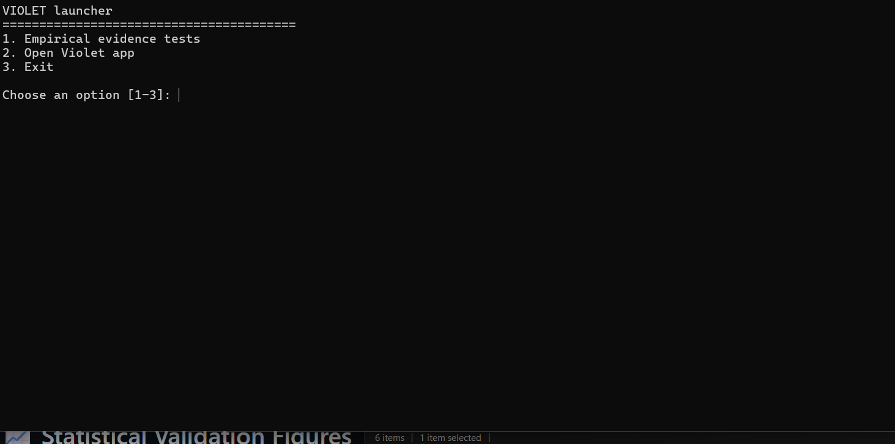
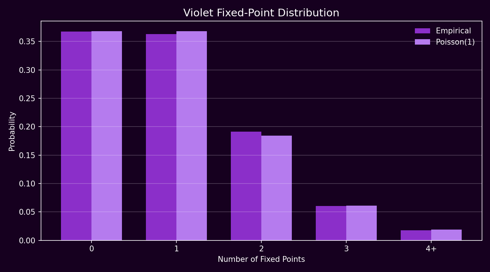
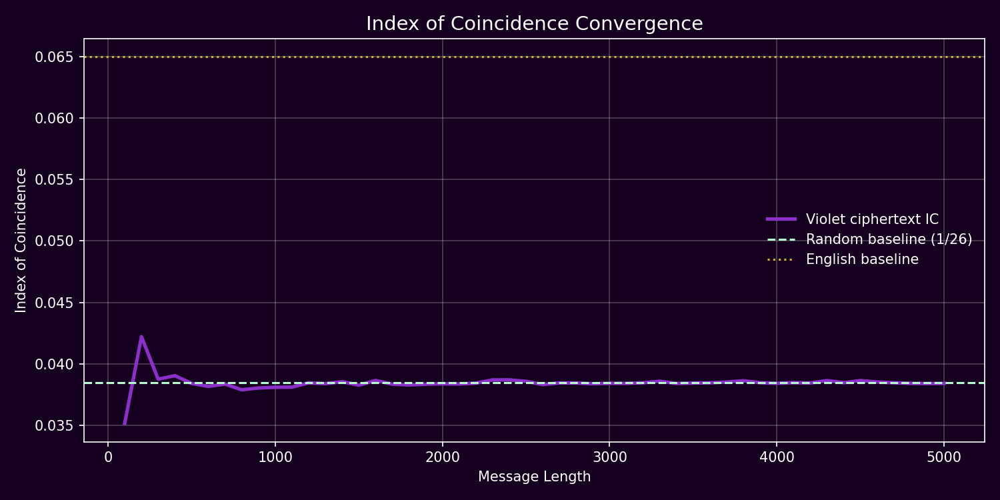
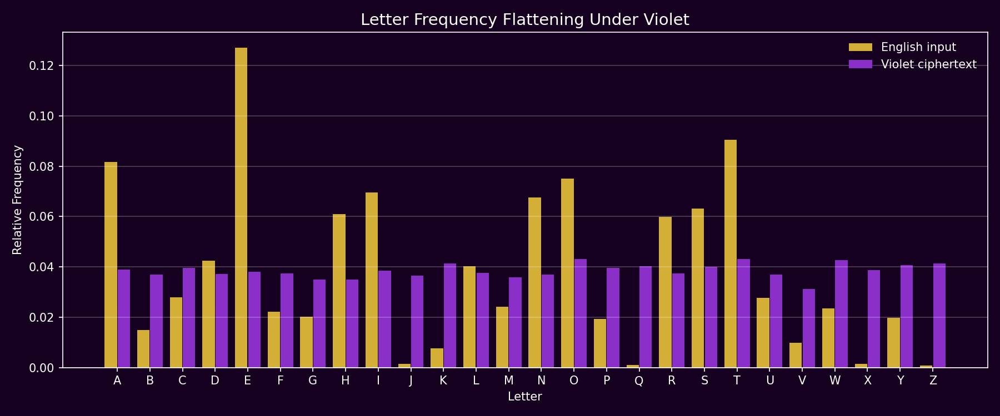
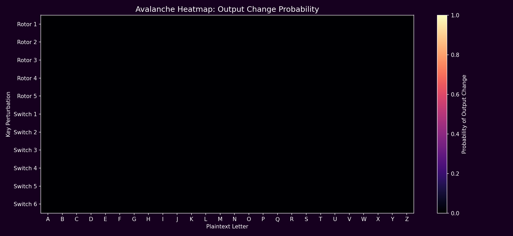
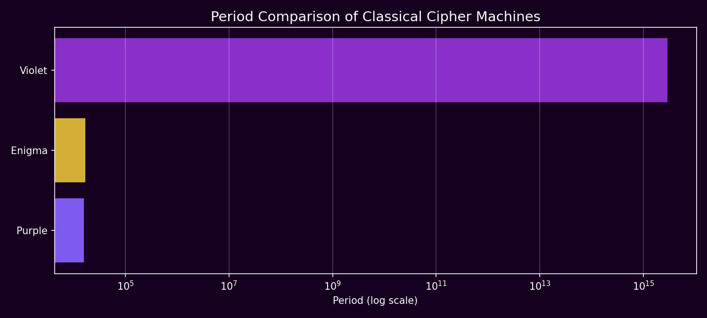
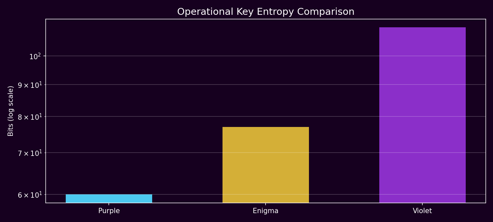
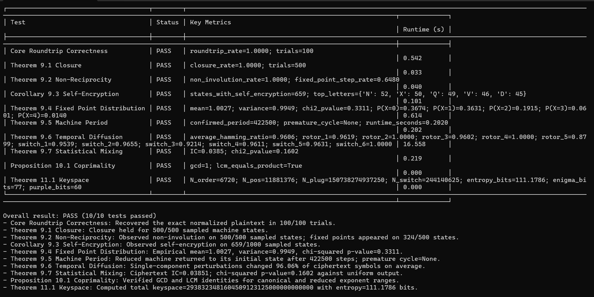

<p align="center">
[](https://opensource.org/licenses/Apache-2.0)


</p>

<h1 align="center">💜 Violet: Cascade Electromechanical Cipher Machine</h1>

<p align="center">
*A beautiful, mathematically rigorous implementation of the cascade electromechanical cipher machine* 🔐✨
</p>

## 🎯 What is Violet?

Violet is a sophisticated Python implementation of a cascade electromechanical cipher machine—the kind of machine that would've made cryptographers in the 20th century absolutely giddy with mathematical joy. It combines rotor-based encryption with stepping-switch mechanisms, all wrapped in a sleek, interactive GUI.

Whether you're interested in **cryptography**, **historical cipher machines**, or just want to play with some delightfully purple encryption—Violet has got you covered! 🎨

### Key Features ✨

- **🔐 Advanced Encryption**: Dual-stage cascade mechanism with rotor evolution and independent stepping-switch logic
- **🎮 Interactive Studio**: Beautiful Tkinter GUI for encrypting/decrypting messages in real-time
- **📊 Statistical Analysis**: Deep dive into cipher characteristics and patterns
- **🧪 Rigorous Testing**: Comprehensive theorem validation and cryptographic testing
- **🎨 Gorgeous UI**: Dark theme with lavender accents that don't hurt your eyes

## 🚀 Quick Start

### Installation

```bash
# Clone the repository
git clone https://github.com/tasmaikeni13/violet.git
cd violet

# Install dependencies
python run.py
```

This will automatically check dependencies and install them if needed!

### Running Violet

**Interactive GUI mode** (Violet Studio):
```bash
python violet_studio/app.py
```

**Run cryptographic tests**:
```bash
python violet_core/test_theorems.py
```

**Statistical analysis**:
```bash
python violet_core/statistical_analysis.py
```

**Auto-launch everything**:
```bash
python run.py
```

## 🏗️ Project Structure

```
violet/
├── violet_core/              # 🧠 The heart of the machine
│   ├── violet_engine.py      # Core cipher engine & rotor mechanics
│   ├── statistical_analysis.py  # Cryptographic property analysis
│   ├── test_theorems.py      # Validation & theorem testing
│   └── plots/                # Generated analysis visualizations
├── violet_studio/            # 🎨 Interactive GUI
│   └── app.py                # Tkinter-based cipher interface
├── docs/                     # 📚 Documentation
│   ├── VIOLET.pdf            # Research paper (foundational theory)
│   ├── how_it_works.html     # Detailed technical explanation
│   └── screenshots/          # UI screenshots
├── requirements.txt          # Dependencies (numpy, scipy, matplotlib)
└── run.py                    # Unified launcher script
```

## 📦 Dependencies

- **numpy** - Lightning-fast numerical operations on permutations
- **scipy** - Statistical computation and analysis
- **matplotlib** - Beautiful visualization of cipher characteristics

All installed automatically via `python run.py` 🎉

## 🔬 The Mathematics Behind It

Violet implements the cascade model:

$$E_t = \sigma_t \circ \rho_t$$

Where:
- **ρ_t** = Rotor stage (evolves over Z₂₆^r)
- **σ_t** = Stepping-switch stage (evolves over Z₂₅^k)
- Composed through elegant permutation mathematics

Each component works independently yet harmoniously to create a robust cipher. See [VIOLET.pdf](docs/VIOLET.pdf) or [how_it_works.html](docs/how_it_works.html) for the full technical deep-dive! 📖


### Launch the beautiful GUI

```bash
python violet_studio/app.py
```

Then enjoy the purple paradise of encrypted messages! 💜

## 🧪 Testing & Validation

Run the comprehensive test suite:

```bash
python violet_core/test_theorems.py
```

This validates:
- ✅ Permutation correctness
- ✅ Rotor stepping mechanics
- ✅ Switching functions
- ✅ Cipher composition properties

## 📊 Statistical Analysis

Generate cryptographic property analysis:

```bash
python violet_core/statistical_analysis.py
```

Includes:
- Distribution analysis of ciphertext
- Rotor state transitions
- Plugboard configuration validation
- Visualizations saved to `violet_core/plots/`

## 🎨 GUI Features

The Violet Studio provides:

- **Real-time encryption/decryption** with live character-by-character processing
- **Configurable machine settings**: rotor selection, plugboard swapping, switch positions
- **Statistical overlay**: view frequency distributions and rotor states
- **Export functionality**: save encrypted messages and configurations
- **Dark theme optimized** for extended cryptography sessions

# 📸 Screenshots

## 🖥 Violet Studio Interface



---

## 📊 Live Cipher Analysis



---

## 🚀 Launcher Menu



---

# 📈 Statistical Validation Figures

## Fixed-Point Distribution



---

## Index of Coincidence Convergence



---

## Letter Frequency Flattening



---

## Avalanche / Diffusion Heatmap



---

## Cipher Machine Period Comparison



---

## Operational Key Entropy Comparison



---

# 🧪 Empirical Test Suite

## Theorem Validation Output



## 📄 License

This project is licensed under the **Apache License 2.0** - see the [LICENSE](LICENSE) file for details.

You're free to use, modify, and distribute this code in your projects! 🎓

## 🤝 Contributing

Found a bug? Have an idea? Contributions are welcome! 

1. Fork the repository
2. Create a feature branch (`git checkout -b feature/amazing-cipher`)
3. Commit your changes (`git commit -m 'Add amazing feature'`)
4. Push to the branch (`git push origin feature/amazing-cipher`)
5. Open a Pull Request


## 🎓 Learning Resources

- **📄 Research Paper**: [VIOLET.pdf](docs/VIOLET.pdf) — The foundational research paper on which this implementation is based. Start here for the mathematical theory!
- **Technical Documentation**: [how_it_works.html](docs/how_it_works.html)
- **Cryptographic Theory**: Classic works on electromechanical ciphers
- **Source Code**: Well-documented and clean—dive in and explore!


## ⭐ Show Your Support

If you find Violet useful or just enjoy parsing permutations, please leave a star! It helps others discover this beautiful cipher machine. 🌟

---

**Made with 💜 and a passion for cryptography**

*"The enemy is listening. Make sure Violet is talking."* 🔐✨

