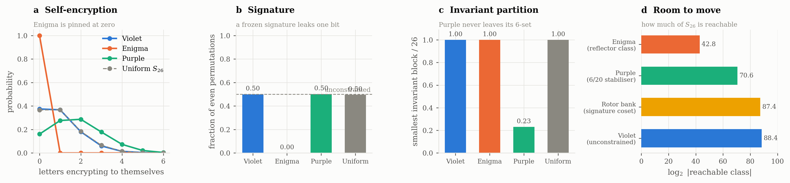
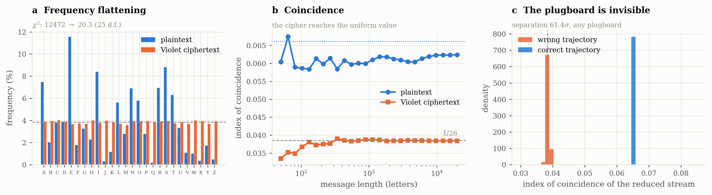
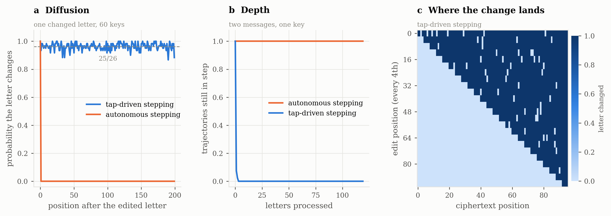
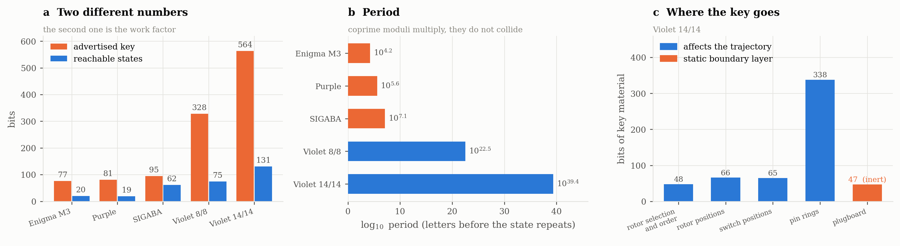
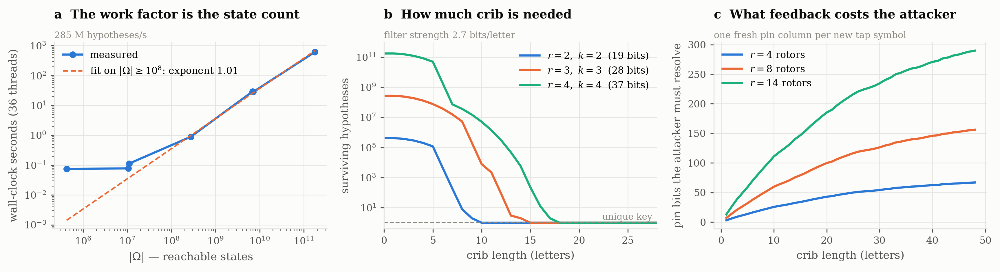

# Violet

Violet is a research and educational implementation of a cascade
electromechanical cipher. It combines a reflectorless rotor bank over 26
letters with a bank of 25-position stepping switches. The goal of the project
is to make the construction, its experiments, and its accompanying formal
development easy to inspect and reproduce.

> **Research software — not a production cipher.** Violet is a new design and
> has not received independent cryptanalysis. Do not use it to protect real
> data.

## The construction

For each letter, Violet applies a static plugboard followed by a rotor stage and
a stepping-switch stage:

```text
E_t = σ(q_t) ∘ ρ(p_t) ∘ P
```

`P` is the plugboard, `ρ` is the reflectorless rotor composition, and `σ` is
the switch-bank composition. In closed-loop mode, the switch bank remains an
autonomous base-25 odometer while the signal at the join between the stages
controls the rotor stepping. This preserves a base-25 period floor even when
the rotor trajectory depends on the message.

The included Studio configuration uses five rotors and six switches. Its
open-loop state cycle is `26^5 × 25^6` (about `2.90 × 10^15` states); the
closed-loop construction retains a guaranteed `25^6`-step no-repeat floor from
the autonomous switch clock.

## What is in the repository

```text
violet_core/       Reference cipher engine, historical comparison models, tests
violet_studio/     Tkinter desktop interface for keys, encryption, and live analysis
analysis/          Reproducible experiments and their machine-readable results
figures/           Generated figures used below and by the paper
docs/              Interactive explanatory page
paper/             Violet paper and its rendered PDF
lean/              Lean 4 formal development
run.py              Small command-line launcher
```

## Quick start

Violet requires Python 3.10 or later. Tkinter is included with most standard
Python installations; on Linux it may be packaged separately as `python3-tk`.

```bash
python -m venv .venv
# Windows: .venv\Scripts\activate
# macOS/Linux: source .venv/bin/activate
python -m pip install -r requirements.txt

python run.py test       # reference-engine checks
python run.py studio     # desktop application
python run.py analyse --quick  # figures except the long attack experiment
```

The Studio can generate, save, and reload JSON keys. It accepts alphabetic
input, normalizes it to A–Z, and exposes the active permutation stream in the
live-analysis tab. Encryption and decryption start from the selected key state,
so use the same key and initial settings for a round trip.

## Evidence and figures

The plots are generated by the scripts in `analysis/`; they are evidence about
the supplied implementation and parameter sets, not proof of real-world
security. The formal statements live separately in `lean/`, and the longer
methodology is in the [paper](paper/violet.pdf).

### Structural invariants



*Figure 1 — `analysis/a1_invariants.py` compares the structural fingerprints of
the reachable permutations. The first three panels show that Violet is not
forced into Enigma's fixed-point-free involutions, does not inherit a frozen
rotor signature, and does not preserve Purple's 6/20 alphabet partition. The
last panel measures reachability under sampled transformations.*

### Ciphertext statistics



*Figure 2 — `analysis/a2_statistics.py` shows frequency flattening, the index
of coincidence approaching the random-alphabet baseline, and the repeated-letter
statistic used in the trajectory experiment. The right panel illustrates why
that statistic is unchanged by a fixed plugboard permutation.*

### Closed-loop diffusion



*Figure 3 — `analysis/a3_diffusion.py` contrasts autonomous and tap-driven
stepping. A one-letter change remains local in the autonomous run, while the
tap-driven path changes almost all later ciphertext. The heatmap shows where
the resulting differences land in a sampled stream.*

### Size and period accounting



*Figure 4 — `analysis/a4_security.py` distinguishes nominal key material from
the state that controls the trajectory, compares nominal periods, and separates
the components that affect the trajectory from the static plugboard layer.*

### Exhaustive-search scaling



*Figure 5 — `analysis/a5_attack.py` reports scaled exhaustive-search runs. The
left plot fits work against reachable states, the middle plot estimates how much
crib text disambiguates a trajectory, and the right plot shows how feedback
increases the cost of that recovery procedure. This experiment is intentionally
the slowest analysis and is omitted by `--quick`.*

## Reproducing the work

```bash
python violet_core/test_theorems.py
python violet_core/statistical_analysis.py --quick
python violet_core/statistical_analysis.py         # includes the long attack experiment
```

The analysis scripts overwrite their corresponding files in `figures/` and
write summary data to `analysis/results/`. The formal development is deliberately
not part of these commands; if Lean and its dependencies are already installed,
its own build instructions are in `lean/`.

## License

No license file is currently included in this checkout. Contact the project
owner before redistributing or using the code outside evaluation and research.
